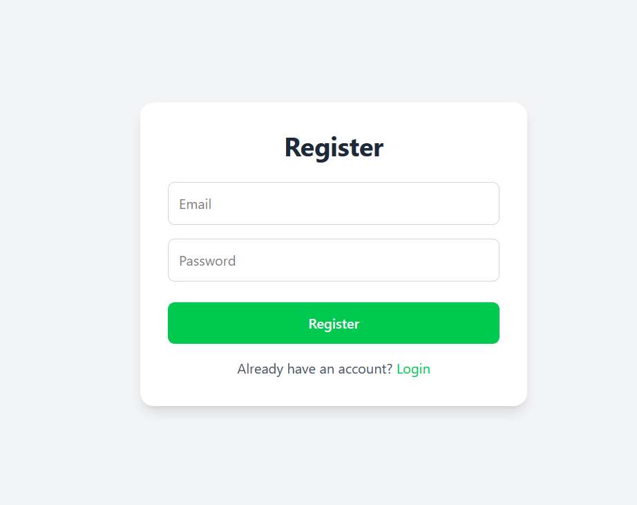
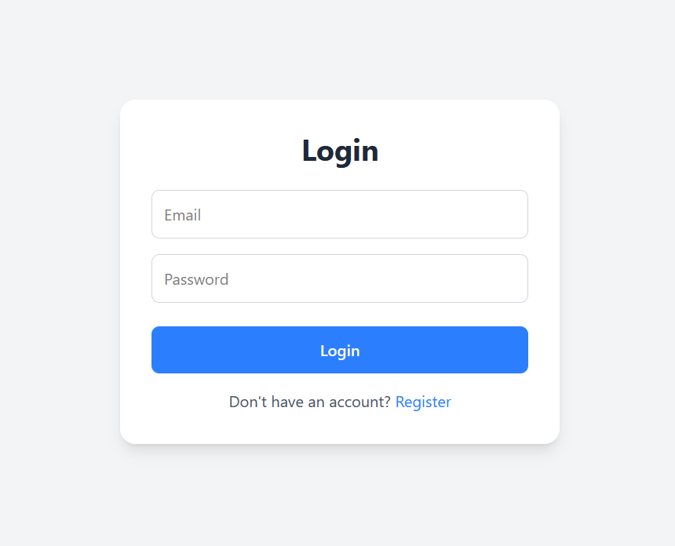
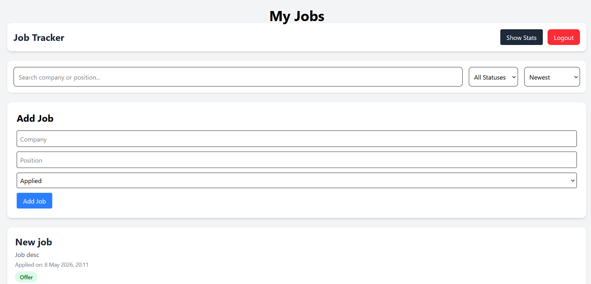

# Job Tracker Frontend

A modern full-stack job application tracker built with React, Vite, Tailwind CSS, and Recharts.

---

## Features

- User authentication (JWT)
- Protected routes
- Add / edit / delete jobs
- Status tracking
- Search & filtering
- Sorting & infinite scroll
- Notes & application history
- Dashboard analytics & charts
- Responsive UI with Tailwind CSS

---

## Tech Stack

- React
- Vite
- Tailwind CSS
- Axios
- React Router
- Recharts

---

## Installation

Run:

npm install

---

## Run Locally

Start the development server:

npm run dev

Frontend runs on:

http://localhost:5173

---

## Environment Variables

Create a `.env` file in the root folder:

VITE_API_URL=http://localhost:3000

---

## Production

Update API requests to use your deployed backend URL:

VITE_API_URL=https://your-backend.onrender.com

---

## Build

npm run build

---

## Deployment

Frontend deployed with:

- Vercel

---

## Screenshots

 

---

## Live Demo

https://job-tracker-frontend-omega-one.vercel.app/
